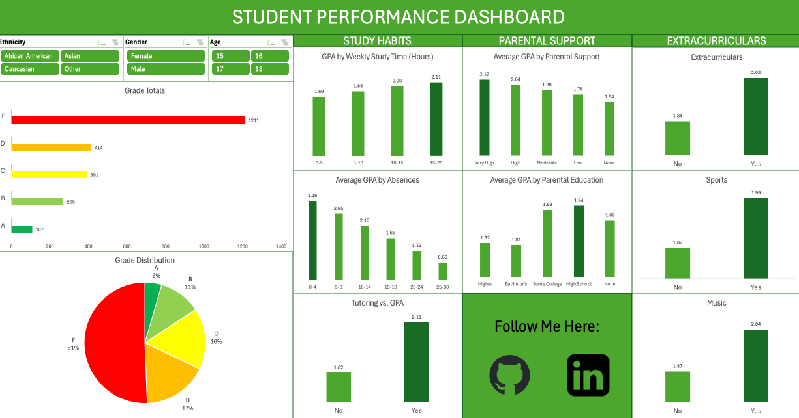

# Student Academic Performance Analysis (Excel Dashboard)

## 📌 Project Overview

This project analyzes academic performance data for **2,392 high school students** to identify key behavioral and environmental factors influencing student outcomes. Using Excel-based exploratory analysis and an interactive dashboard, the project examines how **study habits**, **parental support**, and **extracurricular participation** relate to GPA and overall grade classification.

The goal of this project is to surface **clear, actionable insights** that can inform academic interventions, student support strategies, and future predictive modeling efforts.

---

## 📊 Dataset Description

The dataset contains comprehensive information on **2,392 high school students**, including:

* **Demographics:** Age, gender, ethnicity
* **Study habits:** Weekly study time, absences, tutoring participation
* **Parental involvement:** Parental education level and parental support
* **Extracurricular activities:** Sports, music, volunteering, and general participation
* **Academic performance:** GPA and grade classification

### Target Variable

**GradeClass** categorizes academic performance as follows:

* **A:** GPA ≥ 3.5
* **B:** 3.0 ≤ GPA < 3.5
* **C:** 2.5 ≤ GPA < 3.0
* **D:** 2.0 ≤ GPA < 2.5
* **F:** GPA < 2.0

This dataset is well-suited for **educational research, exploratory analysis, dashboard development, and predictive modeling**.

---

## 📈 Excel Analysis & Dashboard

The analysis was conducted entirely in **Microsoft Excel**, with an emphasis on interactivity, clarity, and stakeholder-friendly insights.

### Key Excel Techniques Used

* Pivot Tables and Pivot Charts
* Binning continuous variables (e.g., study time and absences)
* Slicers for dynamic filtering across all visuals
* Multi-sheet structure for modular analysis
* A centralized dashboard consolidating all key findings

The final dashboard enables users to:

* Filter data dynamically by demographics and student characteristics
* Compare GPA trends across study habits, parental support, and extracurricular involvement
* Quickly identify patterns driving academic performance

🔗 **Interactive Excel Dashboard (OneDrive)**
👉 [View the Excel Dashboard]([https://onedrive.live.com/edit?cid=948746ffa6e63f51&id=948746FFA6E63F51!s35c29fcb0c4a4da28c1cc96e860cbafd&ithint=file%2Cxlsx](https://onedrive.live.com/edit?cid=948746ffa6e63f51&id=948746FFA6E63F51!s35c29fcb0c4a4da28c1cc96e860cbafd&resid=948746FFA6E63F51!s35c29fcb0c4a4da28c1cc96e860cbafd&ithint=file%2Cxlsx&embed=1&wdAllowInteractivity=True&wdHideGridlines=True&wdDownloadButton=True&wdInConfigurator=True&wdInitialSheet=DASHBOARD&wdInitialCell=A1&waccluster=PUS13&migratedtospo=true&redeem=aHR0cHM6Ly8xZHJ2Lm1zL3gvYy85NDg3NDZmZmE2ZTYzZjUxL0lRVExuOEkxU2d5aVRZd2N5VzZHRExyOUFiazExWEd6X1JDMzJGTnhFQXpXcEZZP3dkQWxsb3dJbnRlcmFjdGl2aXR5PVRydWUmd2RIaWRlR3JpZGxpbmVzPVRydWUmd2REb3dubG9hZEJ1dHRvbj1UcnVlJndkSW5Db25maWd1cmF0b3I9VHJ1ZSZ3ZEluaXRpYWxTaGVldD1EQVNIQk9BUkQmd2RJbml0aWFsQ2VsbD1BMSZ3YWNjbHVzdGVyPVBVUzEz&wdo=2))

---

## 🔍 Key Findings

* **Academic underperformance is widespread**, with over **50% of students receiving failing grades**
* **Study habits and attendance** show the strongest relationship with GPA
* GPA increases consistently with higher weekly study time
* Absences have a sharp negative impact on academic performance
* **Parental support** is more strongly associated with GPA than parental education level
* Students participating in **extracurricular activities** tend to have higher GPAs
* Average GPA values are skewed downward due to the heavy concentration of failing grades

---

## ✅ Recommendations / What’s Next

Based on patterns observed in the data, the following actions could have the greatest impact:

* **Attendance-focused interventions** to identify and support at-risk students early
* **Structured study support programs**, such as guided study halls or after-school resources
* **Family engagement initiatives** emphasizing active parental involvement
* **Expanded access to extracurricular activities**, particularly for academically at-risk students

These recommendations align directly with the strongest drivers of academic performance identified in the analysis.

---

## 🎤 Presentation

A presentation was created to communicate findings clearly to non-technical stakeholders, focusing on:

* Study habits
* Parental support
* Extracurricular involvement
* Key issues and actionable next steps

🔗 **Project Presentation (Canva)**
👉 [View the Presentation](https://www.canva.com/design/DAG91q7o8Uk/9TaYTHGH1KBd2EhCTcvvnw/edit?utm_content=DAG91q7o8Uk&utm_campaign=designshare&utm_medium=link2&utm_source=sharebutton)

---

## 🛠 Tools Used

* **Microsoft Excel** – data exploration, analysis, and dashboard creation
* **OneDrive** – dashboard hosting and sharing
* **Canva** – presentation design and storytelling

---

## ⚠️ Notes & Limitations

This analysis is **observational** and does not establish causality. Future work could include regression modeling, longitudinal data analysis, or evaluation of targeted academic interventions to further validate findings.
